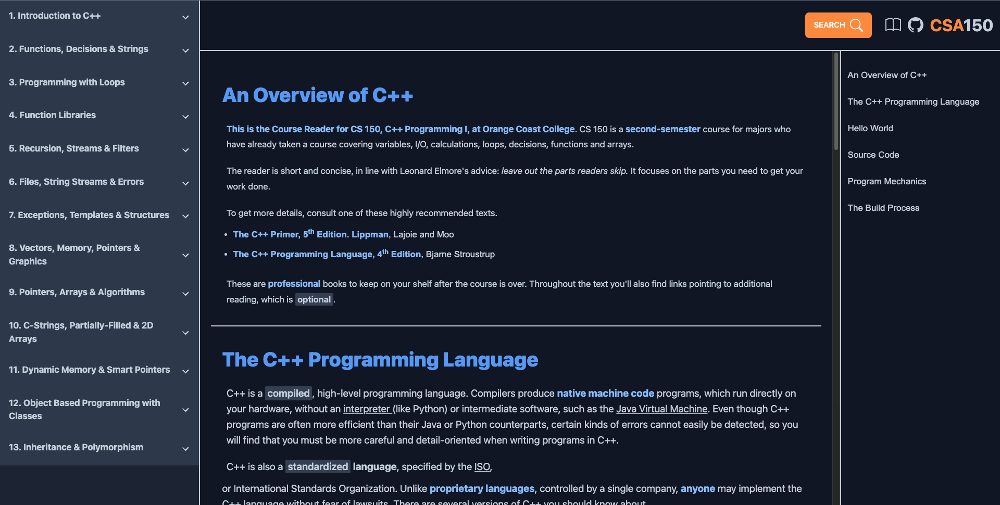

# CS150 Course reader project

This project is intended to improve upon the existing [CS150 Course Reader](https://www.occ-cs.com/book-23/)

This new version aims to include various features:

1. Responsive Design (supporting an intuitive layout for small (mobile) and large (desktop) devices)
2. Improved navigation: Full page chapters for faster readings, sidebar navigation to jump between sections, searchable content so users can jump between chapters without having to traverse the glossary
3. Most importantly... DARK MODE!

---

# New Layout

A new design featuring new layout and new features for intuitive functionality

# Responsive Design

This new design features a responsive layout optimized for mobile devices and smaller screens.

# Full Text Search

A new full-text search feature allows you quickly jump to any topic or chapter.

# Technology

One significant benefit of the old course reader was its fast loading time. We use the [Astro](https://astro.build/) javascript framework to emulate such speed.

Astro allows us to implement new interactive features with javascript without sacrificing speed. Additionally, Astro will enable us to implement interactivity using any javascript framework we choose (ex. React, Svelete, Solid, Vue). I have decided to use the [Vue](https://vuejs.org/) framework.

For our styling, I've chosen TailwindCSS, which provides a faster and more "creative" developer experience, especially when working with the existing CSS of the legacy course reader. However, when writing our own CSS, I have included the SASS/SCSS preprocessor (mainly for nested styling).
