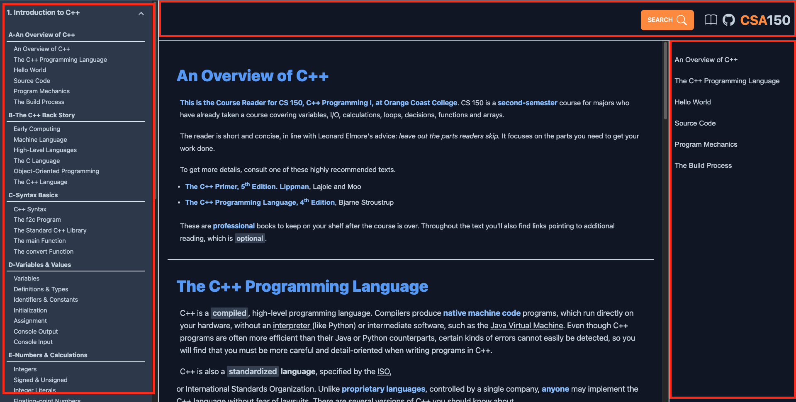
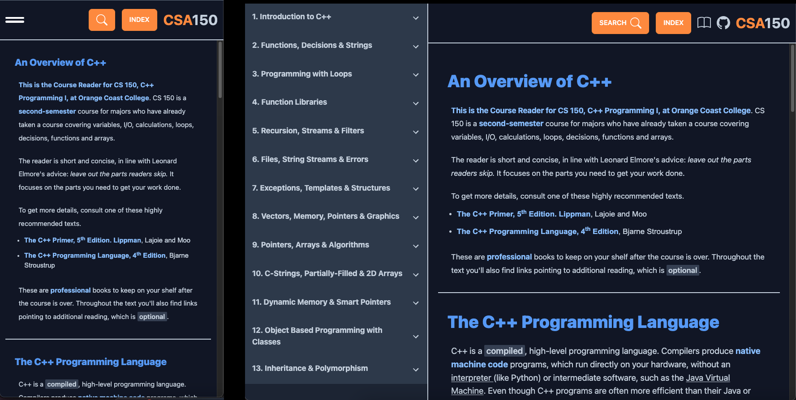
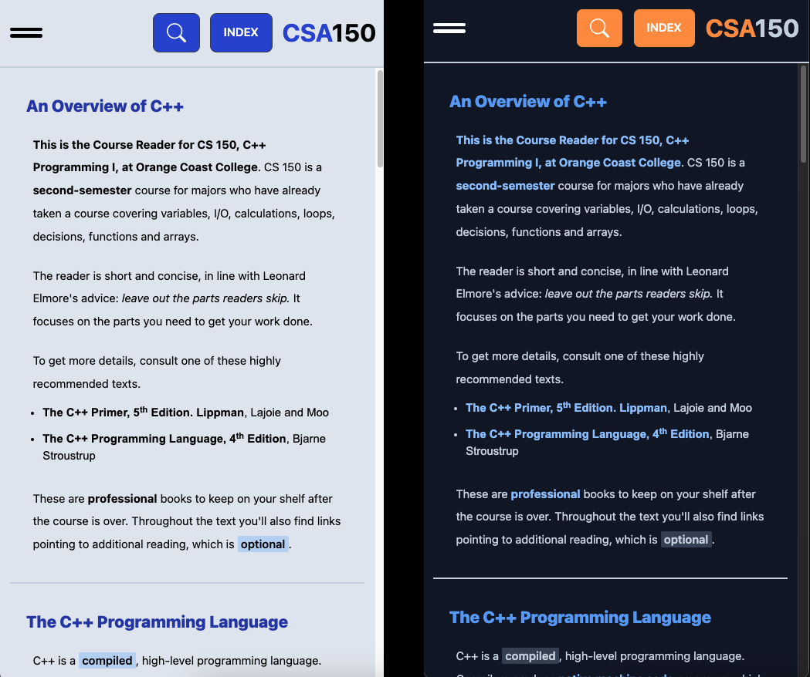
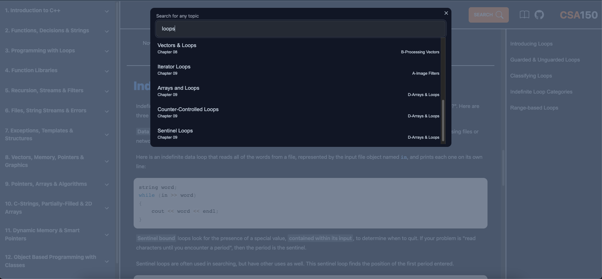

# CS150 Course reader project

This project is intended to build upon the existing [CS150 Course Reader](https://www.occ-cs.com/book-23/), bringing upon new features and designs!

---

## Issues?

Email me directly if you've encountered any issues (i.e., missing images, typos, layout discrepancies).

Subject: CSA150 Course Reader

Please provide the URL, description, and/or images.

## Email: aespejo@student.cccd.edu

# New Layout

A new design featuring a new layout and new features for intuitive functionality

# Responsive Design

This new design features a responsive layout optimized for mobile devices and smaller screens.

# New Dark Mode!!

# Filter Search

A new full-text search feature allows you to quickly jump to any topic or chapter.

# Technology

One significant benefit of the old course reader was its fast loading time. We use the [Astro](https://astro.build/) javascript framework to emulate such speed.

Astro allows us to implement new interactive features with JavaScript without sacrificing speed. Additionally, Astro will enable us to implement interactivity using any javascript framework we choose (ex. React, Svelete, Solid, Vue). I have decided to use the [Vue](https://vuejs.org/) framework.

For our styling, I've chosen TailwindCSS, which provides a faster and more "creative" developer experience, especially when working with the existing CSS of the legacy course reader. However, when writing our own CSS, I have included the SASS/SCSS preprocessor (mainly for nested styling).
